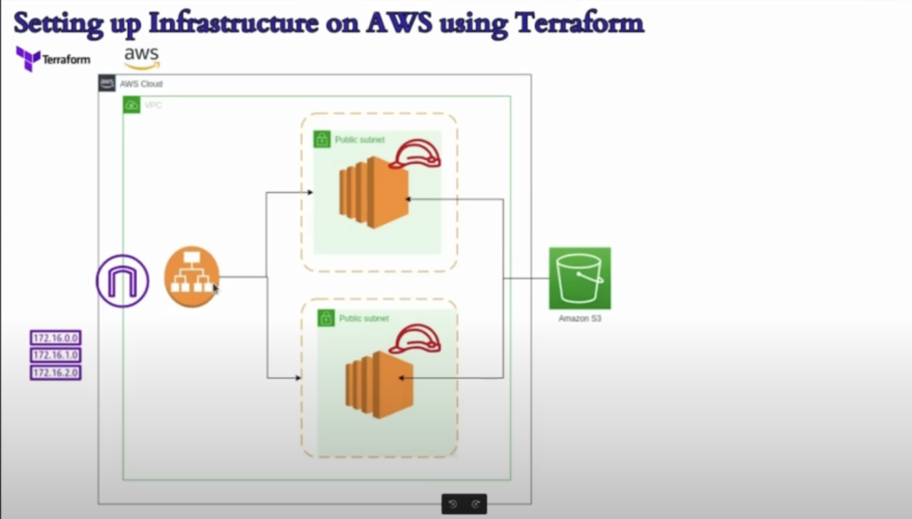

# Terraform Infrastructure Module

This repository contains a Terraform configuration to deploy a simple web application infrastructure on AWS. The infrastructure consists of a VPC, public subnets, EC2 instances, an Application Load Balancer (ALB), security groups, and associated networking components. The goal is to provision a scalable and highly available web environment with load balancing.



## Table of Contents

- [Terraform Infrastructure Module](#terraform-infrastructure-module)
  - [Table of Contents](#table-of-contents)
  - [Prerequisites](#prerequisites)
  - [Getting Started](#getting-started)
- [AWS-Infrastructure-with-terraform](#aws-infrastructure-with-terraform)

---

## Prerequisites

Before you begin, ensure you have the following:

1. **Terraform** installed on your local machine. You can download it from [Terraform Downloads](https://www.terraform.io/downloads.html).
2. An **AWS account** with appropriate permissions to create resources like VPCs, EC2 instances, load balancers, etc.
3. AWS credentials (AWS Access Key and Secret Key) set up via environment variables or the AWS CLI. You can configure them with the command `aws configure`.

---

## Getting Started

1. Clone the repository:
   ```
   git clone https://github.com/okeymcokoli/AWS-Infrastructure-with-terraform.git
   ```

Initialize the Terraform project:

```
terraform init
```
Review the resources to be created:

```
terraform plan
```
Apply the Terraform configuration to create the resources:

```
terraform apply
```

Terraform Configuration Overview
Provider Configuration
In provider.tf, the AWS provider is configured with the us-east-1 region:
see: main.tf, variables.tf and modify variables.tfvars to suit your needs

This specifies the AWS region where the infrastructure will be created.

Resources
- ***VPC***
A VPC is created with the CIDR block defined by cidr_block and a name provided by vpc-name.

- ***Subnets***
Two public subnets are created in two different availability zones, with CIDR blocks 10.0.0.0/24 and 10.0.1.0/24.

- ***Internet Gateway***
An Internet Gateway is created and attached to the VPC.

- ***Route Table***
A route table is created and associated with the public subnets, allowing internet access via the Internet Gateway.

- ***Security Group***
A security group is created to allow HTTP (port 80) and SSH (port 22) traffic from anywhere (0.0.0.0/0).


- ***EC2 Instances***
Two EC2 instances are created with user data scripts. The instances are associated with the public subnets and the security group.


- ***Application Load Balancer (ALB)***
An Application Load Balancer is created, distributing traffic to the two EC2 instances.

- ***Variables***
The module uses the following variables (defined in variables.tf):

vpc-name: Name of the VPC.
azs: List of availability zones for subnet placement.
cidr_block: CIDR block for the VPC.
sg-name: Name for the security group.
ami: Amazon Machine Image (AMI) ID for EC2 instances.
instance-type: Instance type for EC2 instances.
instance-name: Name for EC2 instance 1.
instance-name-2: Name for EC2 instance 2.
key-name: SSH key pair name (optional).
alb-name: Name for the Application Load Balancer.
tg-name: Name for the Target Group associated with the ALB.
You can customize these values in a terraform.tfvars file or directly via the command line.

- ***Outputs***
loadbalancerdns: The DNS name of the created ALB.
Usage
Customize Variables: Create or modify the variables.tfvars file or provide the required variables directly via the command line.


Run Terraform commands:

```
terraform init
terraform plan
terraform apply
```

After applying the Terraform configuration, you will have:

A VPC with two public subnets.
Two EC2 instances running with the specified AMI and instance type.
An Application Load Balancer distributing traffic to the EC2 instances.
Security group rules allowing HTTP and SSH access from anywhere.
Cleaning Up
To destroy the resources and avoid ongoing charges, run:

```
terraform destroy
```

This will remove all the AWS resources created by Terraform.
# AWS-Infrastructure-with-terraform

#Credit to Abhishek Veeramalla and CloudChamp whose original insights were curled for this project.

#Contributions  to this project is very welcome

